# CloudFinOps Sentinel

**An autonomous FinOps agent for Google Cloud.** It inspects a Cloud Run
estate on a schedule, works out what each resource costs against what it
actually uses, fixes the cheap problems by itself, and opens an approval ticket
for the risky ones — then remembers what it did so it never does it twice.

Built on **Gemini 3.5 Flash-Lite** through the **GenAI SDK**, running on
**Cloud Run** with **Firestore**, **Cloud Scheduler**, **Secret Manager** and
**Cloud Trace**.

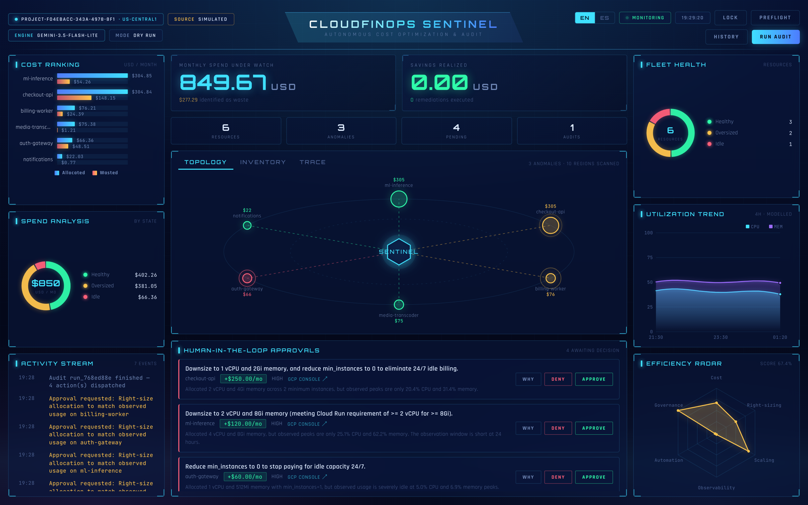

---

## Contents

- [The problem](#the-problem)
- [What the agent actually does](#what-the-agent-actually-does)
- [Architecture](#architecture)
- [The agent loop](#the-agent-loop)
- [The decision model](#the-decision-model) — every threshold and formula
- [Seeing the reasoning](#seeing-the-reasoning)
- [The autonomy matrix](#the-autonomy-matrix)
- [Execution and the trace](#execution-and-the-trace)
- [What "real" means here](#what-real-means-here)
- [Spin-up instructions](#spin-up-instructions)
- [Deploying to Cloud Run](#deploying-to-cloud-run)
- [Configuration](#configuration)
- [API](#api)
- [Resilience](#resilience)
- [Languages](#languages)
- [Tests](#tests)
- [Project layout](#project-layout)
- [Known limitations](#known-limitations)

---

## The problem

Cloud waste is not a hard problem to understand. It is a hard problem to *stay
on top of*. A service is provisioned at 4 GiB "to be safe", ships, and never
touched again. Someone sets `min-instances=1` to dodge cold starts on a service
that serves forty requests a day, and it bills around the clock forever. A disk
outlives the VM it was attached to. None of this is difficult to spot — it is
just nobody's job this week, and the bill arrives monthly.

Dashboards do not fix that, because a dashboard still waits for a person to
look at it and then do the work by hand. This agent looks, decides, and acts.

## What the agent actually does

Every hour, unattended:

1. **Scans** the project — Cloud Run services across ten regions, orphaned
   persistent disks, unused static IPs, untagged Artifact Registry images.
2. **Measures** what each one costs and what it actually uses, pulling real CPU
   and memory peaks from Cloud Monitoring.
3. **Judges** the fleet with Gemini: what is wrong, what shape it should have,
   what could break if you change it.
4. **Plans** an ordered sequence of tool calls, largest saving first.
5. **Acts** — small, reversible changes are applied directly; high-value or
   irreversible ones become an approval ticket that waits for a human.
6. **Remembers** every remediation, ticket and rejection, so the next run knows
   what is genuinely new.

The output is not a report. It is a changed estate, a queue of decisions
waiting for a person, and a full audit trail of why.

---

## Architecture

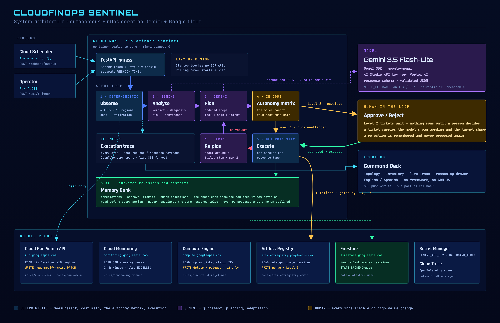

The split down the middle is deliberate:

| | Produced by | Why |
|---|---|---|
| Allocation, utilization, cost, waste | Deterministic code + GCP APIs | Measurement is fact. A model must never invent a number. |
| Diagnosis, recommendation, risk | **Gemini** | Judgement is what a model is for. |
| The plan — which tool, in what order | **Gemini** | Sequencing actions under a goal. |
| Adapting after a failed step | **Gemini** | Deciding whether to retry differently or stop. |
| Level 1 vs Level 2 vs no action | Deterministic code | A persuasive model must not be able to talk its way into an irreversible action. |
| Execution | Deterministic code | One handler per resource type, never inferred. |

## The agent loop

```
Trigger → Observe → Analyse → Plan → Execute → Adapt → Remember
          (code)   (Gemini)  (Gemini)  (code)  (Gemini)  (Firestore)
```

Not a chat loop and not a fixed script. Each audit:

1. **Observes** — four GCP APIs across ten regions in parallel, plus Cloud
   Monitoring for real utilization peaks.
2. **Analyses** — one structured Gemini call over the whole fleet returns a
   verdict, diagnosis, target shape, risk and confidence per resource.
3. **Plans** — a second Gemini call turns that analysis into an *ordered plan*:
   which tool, on which resource, with which arguments, and what each step
   expects to achieve.
4. **Executes** — the agent carries the plan out with the autonomy matrix
   enforced in code.
5. **Adapts** — when a step fails, the plan goes back to the model to be revised
   around the failure (up to `MAX_REPLANS = 2`) rather than abandoning the run.
6. **Remembers** — remediations, tickets, runs, and the *shape* each resource
   had when it was acted on.

Cost is bounded deliberately: **two Gemini calls per audit**, plus one per
failed round. A tool-calling loop would spend one request per invocation and
exhaust a free-tier minute on a single audit.

Both model calls use `response_schema`, so the SDK validates the shape and
there is no parsing guesswork. The planner may only choose from a fixed toolbox
(`resize_service`, `delete_disk`, `release_address`, `delete_image`, `skip`) —
it cannot invent a tool or an argument name.

---

## The decision model

This is the part worth reading closely: how a measurement becomes an action,
and exactly which numbers decide it.

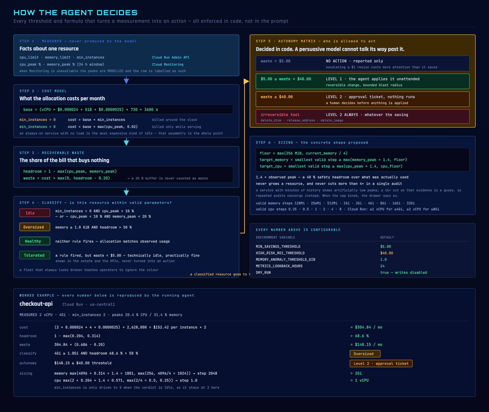

### Step 1 — What is measured

| Value | Source |
|---|---|
| `cpu_limit`, `memory_limit`, `min_instances` | Cloud Run Admin API |
| `cpu_peak %`, `memory_peak %` over 24 h | Cloud Monitoring |

When Cloud Monitoring is unavailable the peaks fall back to a deterministic
model and every row is labelled `MODELLED` instead of `MONITORING`. The
confidence rating drops to `low` and the drawer says why.

### Step 2 — What it costs

Cloud Run Tier-1 on-demand rates, against the *allocated* shape:

```
base = (vCPU × $0.000024 + GiB × $0.0000025) × 730 × 3600 s
```

The billing model then matters more than the shape:

| Condition | Monthly cost | Why |
|---|---|---|
| `min_instances > 0` | `base × min_instances` | Warm instances bill around the clock whether or not traffic arrives |
| `min_instances = 0` | `base × max(cpu_peak, 0.02)` | A scale-to-zero service only bills while it is serving |

That asymmetry is the point: **an always-on service with no load is the most
expensive kind of idle**, and it is the single largest saving the agent
usually finds.

### Step 3 — How much of that is recoverable

```
headroom = 1 − max(cpu_peak, memory_peak)
waste    = cost × max(0, headroom − 0.20)
```

The 20 % buffer is never counted as recoverable. A service running at 85 % peak
has 15 % headroom and zero reported waste — that is a correctly sized service,
not a saving opportunity.

### Step 4 — Is this resource within valid parameters?

| State | Condition | Colour |
|---|---|---|
| **Idle** | `min_instances > 0 AND cpu_peak < 10 %`<br>— or — `cpu_peak < 10 % AND memory_peak < 20 %` | red |
| **Oversized** | `memory ≥ 1.0 GiB AND headroom > 50 %` | amber |
| **Healthy** | neither rule fires | green |
| **Tolerated** | a rule fired, but `waste < $5.00` | green |

`Tolerated` exists because a resource with $1/month of recoverable waste is
correctly sized for practical purposes. Painting it red implies an action that
will never be taken, and a fleet that always looks broken teaches operators to
ignore the colour. Such resources stay in the topology and the KPIs — they exist
and they are fine — with the drawer explaining why no change is proposed.

Rules for the other resource types are simpler, because the waste is total:
`ORPHANED_DISK` (unattached), `UNUSED_STATIC_IP` (reserved, unattached),
`UNTAGGED_IMAGE` (no tag, cannot be deployed by name).

### Step 5 — Who is allowed to act

| Condition | Decision |
|---|---|
| `waste < $5.00` | No action. Reported only. |
| `$5.00 ≤ waste < $40.00` | **Level 1** — the agent applies it unattended |
| `waste ≥ $40.00` | **Level 2** — approval ticket, nothing runs |
| Tool is irreversible | **Level 2 always**, whatever the saving |

Irreversible means `delete_disk`, `release_address` and `delete_image`. The
order of these checks matters and is deliberate: the *value* threshold is
tested first, because escalating a $0.50 cleanup costs more human attention
than it saves, irreversible or not. Only above the threshold does the question
"may this run unattended?" arise.

This is enforced in [`app/core/executor.py`](app/core/executor.py) and
[`app/tools/gcp_remediator.py`](app/tools/gcp_remediator.py) — in code, not in
the prompt. If the model asks for a Level 2 action directly, the tool downgrades
it to a ticket.

### Step 6 — The shape it proposes

```
floor         = max(256 MiB, current_memory / 4)
target_memory = smallest valid step ≥ max(memory_peak × 1.4, floor)
target_cpu    = smallest valid step ≥ max(cpu_peak × 1.4, cpu_floor)
```

- **1.4×** the observed peak — a 40 % safety headroom over what was actually used.
- **Never grows** a resource.
- **Never cuts more than 4× in one audit.** A service with minutes of traffic
  history shows artificially low peaks, and a 16× cut on that evidence is a
  guess rather than a right-sizing. Repeated audits converge safely instead.
  When the cap binds, the drawer says so.
- Valid memory steps: `128Mi 256Mi 512Mi 1Gi 2Gi 4Gi 8Gi 16Gi 32Gi`.
  Valid CPU steps: `0.25 0.5 1 2 4 8`. Cloud Run requires ≥1 vCPU for ≥4Gi and
  ≥2 vCPU for ≥8Gi, and the sizing respects that.
- `min_instances` is only driven to `0` when the verdict is **Idle**.

### A worked example

`checkout-api` — 2 vCPU, 4Gi, `min_instances=2`, peaks 20.4 % CPU / 31.4 % memory:

| | |
|---|---|
| cost | `(2 × 0.000024 + 4 × 0.0000025) × 2,628,000 = $152.42` per instance `× 2` = **$304.84/mo** |
| headroom | `1 − max(0.204, 0.314)` = **68.6 %** |
| waste | `304.84 × (0.686 − 0.20)` = **$148.15/mo** |
| classify | `4Gi ≥ 1.0Gi` and `68.6 % > 50 %` → **Oversized** |
| autonomy | `$148.15 ≥ $40.00` → **Level 2, approval ticket** |
| sizing | memory `max(4096 × 0.314 × 1.4 = 1801, max(256, 1024))` → step **2048 = 2Gi** |
| | cpu `max(2 × 0.204 × 1.4 = 0.571, max(0.5, 0.25))` → step **1.0 = 1 vCPU** |

### Every threshold is configurable

| Variable | Default | Controls |
|---|---|---|
| `MIN_SAVINGS_THRESHOLD` | `5.0` | Below this, a finding is reported but never actioned |
| `HIGH_RISK_ROI_THRESHOLD` | `40.0` | At or above this, a human must approve |
| `MEMORY_ANOMALY_THRESHOLD_GIB` | `1.0` | Allocation that counts as large enough to be "oversized" |
| `METRICS_LOOKBACK_HOURS` | `24` | Observation window for the peaks |
| `DRY_RUN` | `true` | Master safety gate — writes disabled |

---

## Seeing the reasoning

Every recommendation is auditable. Clicking any row, node or approval opens a
drawer with the complete chain: the model's judgement first, then the
measurements it was given, then the rule, the proposed change, and the
autonomy decision.

**The model's analysis, and the evidence underneath it**

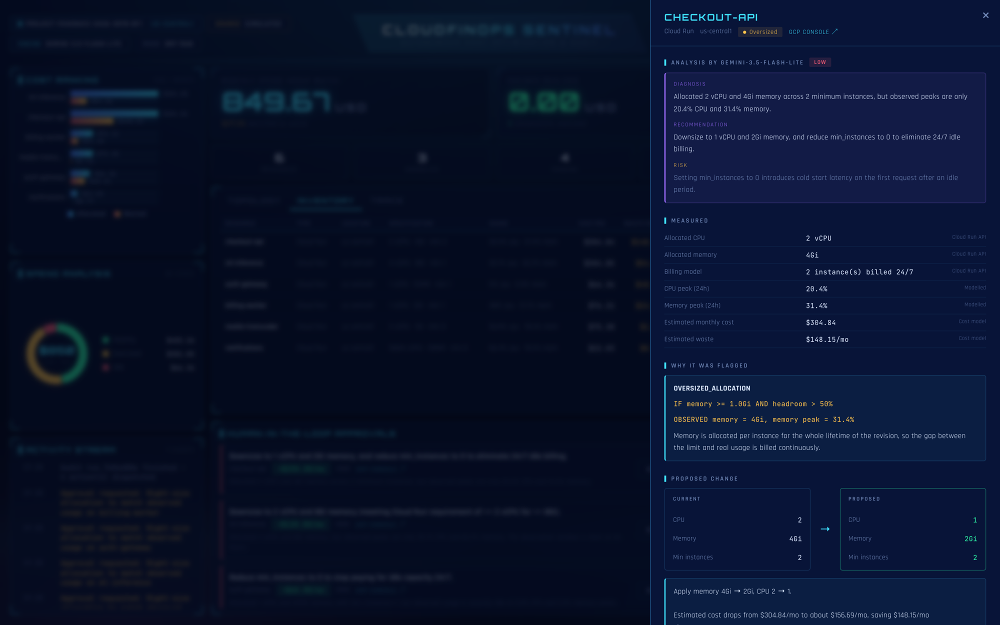

The `ANALYSIS BY GEMINI-3.5-FLASH-LITE` block is the model's own wording —
diagnosis, recommendation and risk. Below it, `MEASURED` lists every number the
model was given, each labelled with where it came from (`Cloud Run API`,
`Modelled`, `Cost model`), so a recommendation can always be traced back to the
facts behind it. `WHY IT WAS FLAGGED` names the rule id, the condition that was
checked, and the values observed.

**The proposed change, and why it is allowed or not**

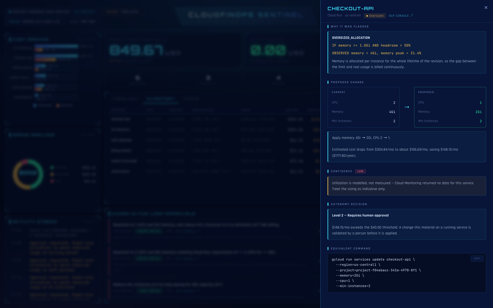

`PROPOSED CHANGE` is a before/after of the concrete shape, with the monthly and
yearly saving. `CONFIDENCE` is graded on how much real metric history exists —
`low` here, because Cloud Monitoring returned no data for this service and the
peaks are modelled. `AUTONOMY DECISION` states the level and quotes the
threshold that produced it. `EQUIVALENT COMMAND` is the exact `gcloud` an
operator could run to apply the same change by hand.

**The whole estate, in its own terms**

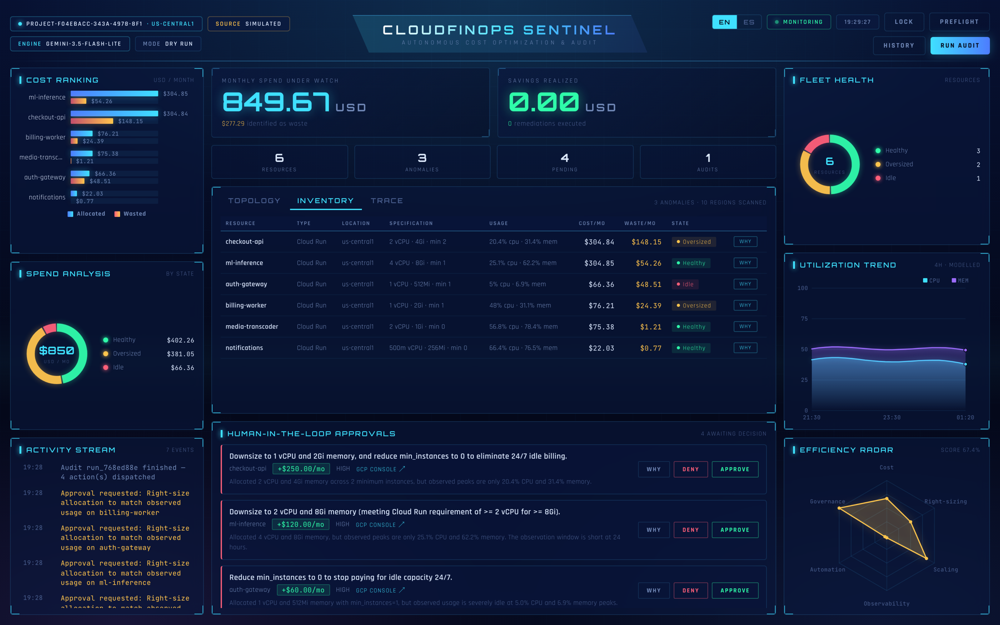

The inventory shows every managed resource with its specification, observed
usage, monthly cost, recoverable waste and state. Types are described in their
own terms — a disk is not forced into Cloud Run's columns.

## The autonomy matrix

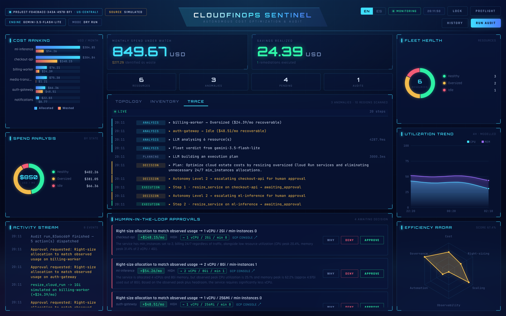

Level 2 findings become tickets in `HUMAN-IN-THE-LOOP APPROVALS`. Nothing runs
until someone clicks **APPROVE**.

**What you approve is what runs.** The headline of every ticket ends in the
exact target shape — `→ 1 vCPU / 2Gi / min-instances 0` — and that shape is what
execution reads. It is not prose about the change, it *is* the change:

- The planner names only the dimension it cared about. A step meaning "scale to
  zero" carries `min_instances` and no memory. What is missing is resolved from
  the deterministic sizing for that resource, then from the shape it already
  has — never from a constant, because a default is a change nobody proposed.
- If no shape can be established, the ticket is still raised so the finding
  stays visible, and execution **refuses** it rather than guessing.
- The shape is validated against Cloud Run's own constraints before it is
  offered: ≥1 vCPU for ≥4Gi and ≥2 vCPU for ≥8Gi. A model that says "2 vCPU"
  in prose and encodes `1` produces a deploy Cloud Run rejects, which reads to
  an operator as the agent being broken rather than the plan being wrong.
- The saving on the ticket is the **measured** `wasted_cost`, never the model's
  `estimated_saving`. The model's figure is a guess, and the thresholds and the
  realised-savings KPI are defined against the measurement.

The shape is deliberately left untranslated, for the same reason a `gcloud`
command is: it is a technical value, not a sentence. The model's own wording is
kept on the ticket and shown in the reasoning drawer, where it explains the
change rather than promising one.

### The ticket goes and finds a person

The agent runs hourly while nobody is watching. A ticket that only exists in a
dashboard nobody has open is a human-in-the-loop that depends on someone walking
past it, so a raised ticket is pushed to **Slack** and **Telegram**:

```bash
SLACK_WEBHOOK_URL=https://hooks.slack.com/services/...
TELEGRAM_BOT_TOKEN=123456:AA...   TELEGRAM_CHAT_ID=-100...
DASHBOARD_URL=https://cloudfinops-sentinel-....run.app
```

**Setting up Telegram**, which takes about a minute:

1. Message [@BotFather](https://t.me/BotFather), send `/newbot`, and copy the
   token it gives you into `TELEGRAM_BOT_TOKEN`.
2. Send your new bot any message, then open
   `https://api.telegram.org/bot<TOKEN>/getUpdates` and copy `result[0].message.chat.id`
   into `TELEGRAM_CHAT_ID`. A bot cannot start a conversation, so this first
   message is what lets it reply.
3. Confirm it took, without waiting for an audit:

```bash
curl -H "Authorization: Bearer $DASHBOARD_TOKEN" localhost:8080/api/preflight
# → Notifications  ok  "Approval tickets are pushed to telegram."
```

Preflight warns when no channel is configured, because a scheduled run raising
a ticket at 3am into an empty room looks exactly like a run that found nothing.
It is also the fastest way to catch the one mistake that actually bites here:
configuration is read once at startup, so a `.env` edited while the service is
running changes nothing until it restarts.

A ticket is announced when it is raised — but raising is guarded against
duplicates, so a resource that already has a ticket never reaches that code
again. A ticket raised before a channel was configured, or one whose delivery
failed, would otherwise stay pending and silent forever while every later audit
skipped it. So each audit ends by announcing whatever is still pending and has
never been delivered, and records on the ticket that someone was reached. A
failed delivery leaves it owed, not handled.

Delivery is visible where every other action is — on the trace:

```
DECISION   Autonomy Level 2 → escalating checkout-api for human approval
APPROVAL   Approval for checkout-api pushed to slack, telegram      ▸ detail
```

The message carries the money, the resource, and **the target shape that will
be applied** — the same contract the approver sees in the deck — plus a link
back into it.

Every channel is optional and every one degrades quietly. An unconfigured
channel is skipped rather than reported as a failure; a channel that is down is
logged and stepped over. The ticket is persisted *before* anyone is told, so a
dead webhook costs the notification and never the finding. Delivery runs off the
audit's thread for the same reason: a webhook that takes ten seconds must not
add ten seconds to the audit.

### Rejections are remembered

`last_rejection()` is checked before any action, so a change a human has already
declined is never proposed again — that repetition is
exactly the alert fatigue the savings threshold exists to prevent.

The Memory Bank also records the *shape* a resource had when it was acted on,
and a later scan compares against it:

- unchanged since the last action → duplicate, skipped;
- changed and still wasteful → eligible again;
- previously rejected by a human → skipped regardless of shape.

Without the shape comparison a partially fixed resource would be blocked
forever, and the dashboard would show an anomaly with no ticket to act on.

## Execution and the trace

The **Trace** tab streams every step live over server-sent events, grouped by
phase, with the real payloads attached.

**The reasoning pipeline, step by step**

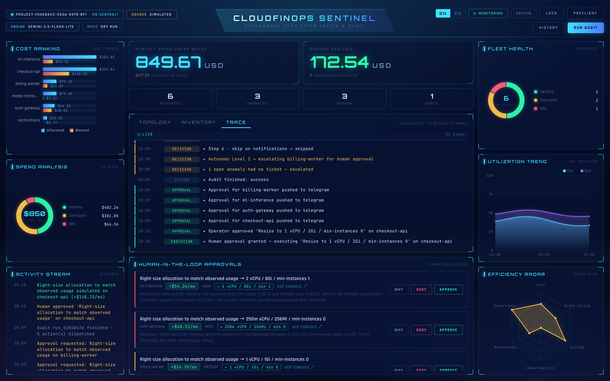

`ANALYSIS` steps show each resource being evaluated against the detection rules
with its recoverable waste. `PLANNING` and `DECISION` show the model building an
execution plan and the autonomy matrix classifying each step.

**The Gemini call, with its request and response**

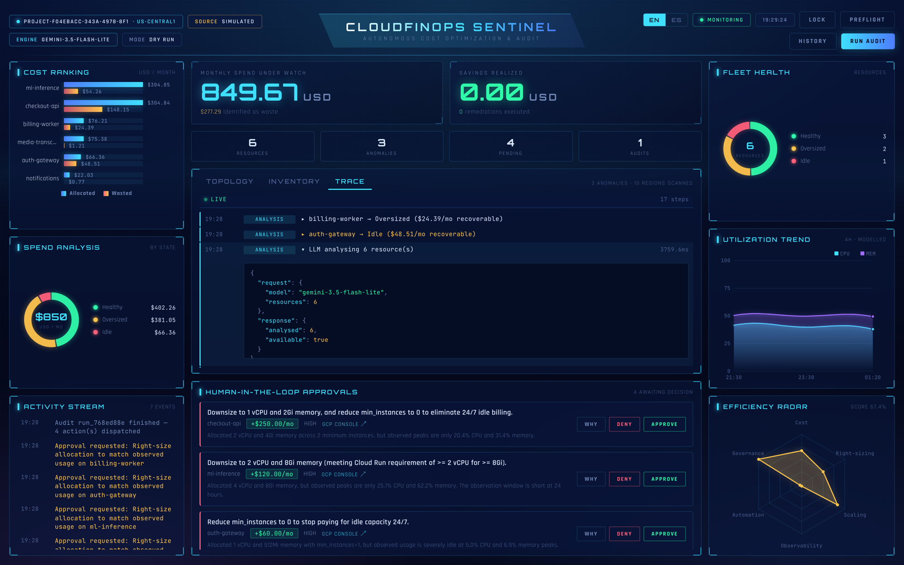

Clicking any step expands its payload. For a model call that is the request
shape, the model used, and how many resources came back analysed.

**A mutation, with what was actually sent**

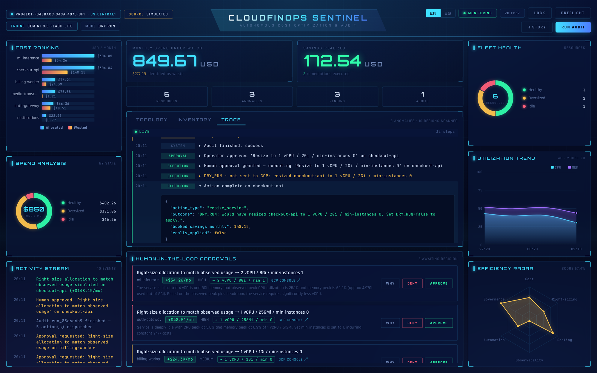

For a mutation the payload is the point. The trace records the approval, the
handler that was dispatched, and the outcome. While `DRY_RUN=true` the step is
recorded as `DRY_RUN · not sent to GCP` and carries the change it *would* have
made, so the exact request can be reviewed before writes are ever enabled.

With `DRY_RUN=false` the same step carries GCP's own confirmation instead — the
new revision name, the limits actually applied, and the `Ready` condition:

```json
{
  "gcp_confirmed": true,
  "ready_state": "CONDITION_SUCCEEDED",
  "new_revision": "service-idle-00042-xyz",
  "applied_limits": {"cpu": "250m", "memory": "512Mi"},
  "uri": "https://service-idle-....run.app"
}
```

**Scan history**

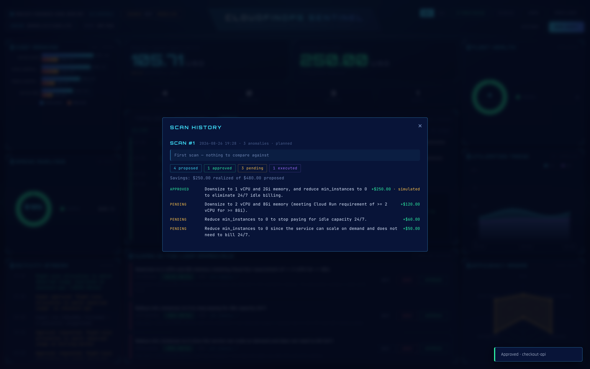

Each run is recorded with what it proposed, what was approved, what is still
pending and what executed — and how much of the proposed saving was actually
realized.

> Trace messages, API method names and payload keys stay in English regardless
> of the UI language — it is a technical console, and translating
> `projects.locations.services.patch` would make it harder to match against GCP
> documentation.

---

## What "real" means here

The product never presents invented infrastructure as real:

- **An empty project is a real answer.** A successful API call that returns zero
  services reports `data_source: gcp` with an empty fleet — it is not replaced
  with demo data.
- **Simulated data requires explicit opt-in.** Only `MOCK_MODE=true`, or an API
  failure with `ALLOW_SIMULATED_FALLBACK=true`, produces the demo fleet — and the
  header says `SOURCE: SIMULATED` when it does.
- **Unreadable sources are shown, not hidden.** A disabled API or missing role
  appears as an amber badge under the topology instead of silently reading as
  "nothing found".
- **Utilization is labelled.** `MONITORING` when it came from Cloud Monitoring,
  `MODELLED` when the metric was unavailable.
- **The two worlds never mix.** The on-ramp above is to run the simulated fleet
  first and point the agent at a real project afterwards. An approval ticket
  outlives the audit that raised it, so the demo fleet gets its own memory bank
  (`data/memory_bank.mock.json`), and every ticket records which world raised
  it. Approving a demo service against a live project is refused rather than
  attempted — otherwise the agent tries to resize a service that never existed
  and the operator sees a bare `404 ... does not exist`.

### Nothing runs until you ask

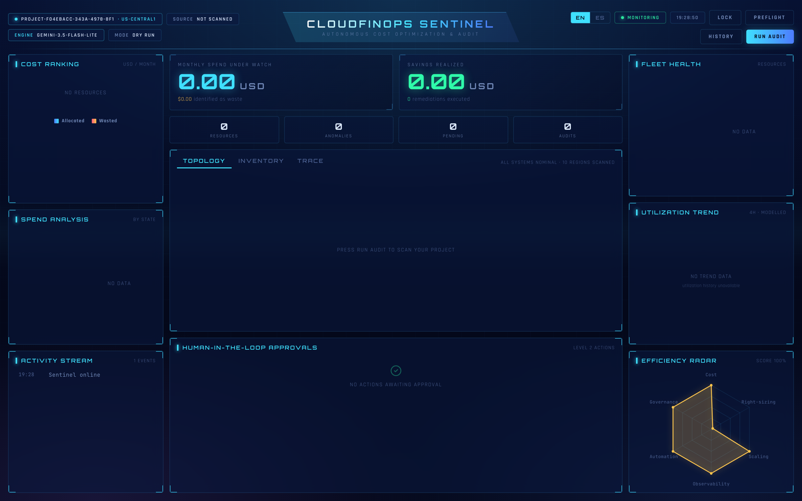

Starting the service touches no GCP API. The dashboard opens idle
(`SOURCE: NOT SCANNED`) and polling never triggers a scan — `/api/state` reads
cache only. Discovery, analysis and remediation all begin when the operator
presses **RUN AUDIT**, or a scheduler calls `/webhook/pubsub`.

That keeps a restart free, avoids surprise API quota usage, and makes the trace
correspond to one deliberate run instead of ambient background activity.

### Authentication

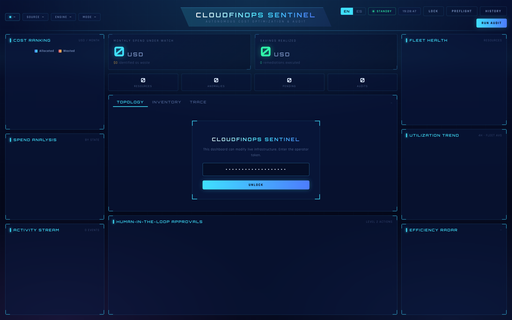

There is no unauthenticated mode. Every endpoint that reads the estate or acts
on it requires an operator token — locally and hosted alike. An "only in
development" bypass is precisely what ends up deployed, and this dashboard
deletes disks.

Start without a token and the agent generates one for that run and prints it; it
never falls back to serving openly. On Cloud Run nothing is generated — the
operator supplies it deliberately, and until then every request is refused.

The token is exchanged for an HttpOnly, SameSite=strict cookie; scripts can use
`Authorization: Bearer <token>` instead. Comparison is constant-time. Cloud
Scheduler authenticates with a **separate** `WEBHOOK_TOKEN`, so a leaked
scheduler credential cannot press the approval buttons. `/health` stays open for
Cloud Run probes and exposes nothing sensitive.

---

## Spin-up instructions

### Run it locally in two minutes

No API key and no GCP project required — it runs against a simulated six-service
fleet and falls back to a deterministic heuristic audit if Gemini is not
configured. The dashboard labels which mode you are in (`SOURCE: SIMULATED`,
`ENGINE: HEURISTIC`) so demo data is never mistaken for live data.

```bash
git clone https://github.com/Mgodoyd/CloudFinOps-Sentinel-Agent.git
cd CloudFinOps-Sentinel-Agent

python3 -m venv .venv && source .venv/bin/activate
pip install -r requirements-dev.txt

cp .env.example .env          # add GEMINI_API_KEY to enable the LLM (optional)

MOCK_MODE=true DASHBOARD_TOKEN=dev-token \
  uvicorn app.main:app --reload --port 8080
```

Open <http://localhost:8080> and unlock it with `dev-token`. Press **RUN AUDIT**.

Run the tests with `pytest` — **354 pass, 2 skip** (the two need the
OpenTelemetry exporter), no credentials needed.

### Point it at a real GCP project

Drop your service-account JSON in the project root — `PROJECT_ID` and
credentials are picked up automatically, no env var needed. Then check what
actually works:

```bash
python -m app.tools.preflight
```

Preflight verifies credentials, every API the agent depends on, and write
access, and prints the exact `gcloud` command that fixes each failure with your
service account's email already filled in. The same report is at
`/api/preflight` and behind the **PREFLIGHT** button in the dashboard.

#### Required APIs and roles

| Capability | API | Role |
|---|---|---|
| Read Cloud Run services | `run.googleapis.com` | `roles/run.viewer` |
| **Resize** Cloud Run services | `run.googleapis.com` | `roles/run.admin` |
| Real CPU/memory utilization | `monitoring.googleapis.com` | `roles/monitoring.viewer` |
| Gemini via Vertex AI *(optional)* | `aiplatform.googleapis.com` | `roles/aiplatform.user` |
| Delete orphaned disks *(optional)* | `compute.googleapis.com` | `roles/compute.storageAdmin` |
| Purge untagged images *(optional)* | `artifactregistry.googleapis.com` | `roles/artifactregistry.admin` |

```bash
PROJECT=your-project
SA=your-sa@your-project.iam.gserviceaccount.com

gcloud services enable run.googleapis.com monitoring.googleapis.com --project=$PROJECT
gcloud projects add-iam-policy-binding $PROJECT --member=serviceAccount:$SA --role=roles/run.viewer
gcloud projects add-iam-policy-binding $PROJECT --member=serviceAccount:$SA --role=roles/monitoring.viewer
```

### The DRY_RUN safety gate

`DRY_RUN=true` is the default. In that mode the agent does everything — detects
anomalies, reasons, decides, opens approval tickets — but reports the change it
*would* make instead of applying it. Remediations are recorded with
`applied: false` and the header shows `MODE: DRY RUN`.

To let the agent actually modify infrastructure:

```bash
DRY_RUN=false uvicorn app.main:app --port 8080
```

The header switches to a red **LIVE WRITES** badge. In this mode
`resize_cloud_run` performs a real read-modify-write on the service template
(preserving image, env vars, scaling and concurrency) and deploys a new
revision. Grant `roles/run.admin` first.

## Deploying to Cloud Run

```bash
./deploy/deploy.sh
```

One command: enables the APIs, creates a least-privilege service account,
provisions Firestore, stores the Gemini key and dashboard token in Secret
Manager, builds and deploys the container, and schedules hourly audits with
Cloud Scheduler. See [deploy/README.md](deploy/README.md) for what each role is
for and how to verify the result.

The Cloud Scheduler job is what makes the agent autonomous rather than
button-driven: it runs while nobody is watching and leaves approval tickets
waiting.

### Persistence

The Memory Bank is what stops the agent looping, so where it lives matters.
`STATE_BACKEND=auto` picks the right one: **Firestore** when running on Cloud
Run (whose filesystem is ephemeral — a new revision would otherwise forget
everything it had already remediated), a **local JSON file** otherwise. Set it
to `firestore`, `file` or `none` to override.

If Firestore is unreachable the agent starts anyway and says so: an agent that
cannot read its history is still more useful than one that will not boot.

The property this rests on is covered directly: a test builds a memory bank,
records a remediation, discards the process the way a new Cloud Run revision
does, and asserts the next one still knows what was already fixed and what a
human already rejected. Without it the agent re-proposes what it remediated and
re-raises what was declined — a failure that never errors, it just quietly
forgets.

---

## Configuration

Everything is environment-driven — see [.env.example](.env.example). Credentials
resolve through Application Default Credentials on Cloud Run.

| Variable | Default | Purpose |
|----------|---------|---------|
| `PROJECT_ID` / `REGION` | *(from key file)* / `us-central1` | Which project to audit |
| `GEMINI_API_KEY` | *(empty)* | Enables the LLM agent; empty → heuristic mode |
| `USE_VERTEX` | `false` | Use Vertex AI with the service account instead of a key |
| `GEMINI_MODEL` | `gemini-3.5-flash-lite` | Must support `generateContent`; falls back automatically |
| `DRY_RUN` | `true` | **Safety gate** — false lets the agent mutate live infrastructure |
| `USE_REAL_METRICS` | `true` | Pull utilization from Cloud Monitoring |
| `METRICS_LOOKBACK_HOURS` | `24` | Observation window for utilization peaks |
| `MIN_SAVINGS_THRESHOLD` | `5.0` | Below this a finding is reported, never actioned |
| `HIGH_RISK_ROI_THRESHOLD` | `40.0` | Savings above which a human must approve |
| `MEMORY_ANOMALY_THRESHOLD_GIB` | `1.0` | Memory allocation that counts as oversized |
| `MAX_TOOL_CALLS` | `4` | Tool calls per audit; each one is an API request |
| `METRICS_CACHE_TTL` | `60` | Seconds a Cloud Run listing is cached |
| `STATE_FILE` | `data/memory_bank.json` | Local memory-bank path |
| `STATE_BACKEND` | `auto` | `firestore` on Cloud Run, `file` locally |
| `DASHBOARD_TOKEN` | *(generated locally)* | **Required.** Unlocks the dashboard and API |
| `WEBHOOK_TOKEN` | *(falls back to dashboard)* | Separate credential for Cloud Scheduler |
| `GEMMA_MODEL` | `gemma-4-31b-it` | Second-tier model; empty disables the tier |
| `SLACK_WEBHOOK_URL` | *(empty)* | Push approval tickets to Slack |
| `TELEGRAM_BOT_TOKEN` / `TELEGRAM_CHAT_ID` | *(empty)* | Push approval tickets to Telegram |
| `DASHBOARD_URL` | *(empty)* | Link back into the deck from a notification |
| `OTEL_ENABLED` | `true` | Export OpenTelemetry spans to Cloud Trace |
| `MOCK_MODE` | `false` | Skip GCP entirely and use simulated infrastructure |
| `SCAN_REGIONS` | `auto` | Regions to scan, or a comma-separated list |
| `ALLOW_SIMULATED_FALLBACK` | `false` | Substitute demo data when a GCP call fails |

### Multi-region and multi-service discovery

Scanning one region misses services deployed elsewhere. `SCAN_REGIONS=auto`
probes ten common Cloud Run regions in parallel; set it to a comma-separated
list to narrow the scan.

Discovery covers Cloud Run services, orphaned persistent disks, unused static
IPs and untagged Artifact Registry images, all in one inventory. Each source
degrades independently: a disabled Compute API does not stop the Cloud Run audit.

## API

| Method | Path | Description |
|--------|------|-------------|
| `GET` | `/` | Command deck dashboard |
| `GET` | `/health` | Liveness probe + active agent mode |
| `GET` | `/api/state` | Full dashboard snapshot: KPIs, approvals, resources, charts, activity |
| `GET` | `/api/resources?refresh=true` | Fleet inventory, optionally bypassing the cache |
| `GET` | `/api/resources/{id}/rationale` | Why a resource was flagged, and the concrete fix |
| `GET` | `/api/events?limit=50` | Activity log |
| `GET` | `/api/trace?since=N` | Execution steps with request/response payloads |
| `GET` | `/api/trace/stream` | Live SSE feed of execution steps |
| `POST` | `/api/trigger` | Start an audit in the background |
| `POST` | `/api/audit` | Run an audit and wait for the result |
| `POST` | `/api/approvals` | `{resource_id, status}` — approve or reject a ticket |
| `POST` | `/webhook/pubsub` | Cloud Scheduler / Pub/Sub push entrypoint |
| `GET` | `/api/preflight` | Readiness report: credentials, APIs, roles, write access |
| `POST` | `/api/reset` | Clear the memory bank (demo reset) |

Interactive docs at `/docs`.

### Live updates

The dashboard polls every 5 seconds, but waiting for the next tick makes a click
feel unacknowledged. Every mutation — an approval, a rejection, a completed
execution, a finished audit — pushes a `{"kind": "state"}` message down the same
SSE stream that carries the trace, and every open dashboard refetches
immediately. Measured approval-to-render latency: **~12 ms**, against a 5000 ms
poll interval. The poll remains as a fallback, and the approval card dims
optimistically so the click registers before the round-trip completes.

---

## Resilience

The LLM is the optional part of this system. The audit itself — anomaly
detection, cost math, the autonomy matrix, the memory bank — is deterministic
and always runs. When Gemini is unavailable the agent finishes heuristically and
says so, rather than losing the cycle:

### Degradation has three steps, not two

```
Gemini   →  per-resource judgement + fleet summary
Gemma    →  deterministic findings + a real fleet summary
neither  →  deterministic findings, no narrative
```

**Gemma is the second tier.** Gemini going down is usually quota or capacity,
and both are per-model, so a different model is a real second chance rather than
a retry of the same failure. Gemma is served by the same API and the same SDK —
this is a model name, not a second integration.

It is deliberately given a *narrower* job, and the narrowness is measured rather
than stylistic. Against the six-service demo fleet:

| Asked for | Result |
|---|---|
| The analyst's full per-resource schema, one resource | timed out past 100 s |
| The same, no schema, one resource | 50 s |
| The same, no schema, six resources | `504 DEADLINE_EXCEEDED` |
| **A one-paragraph fleet summary, six resources** | **~18 s** |

So Gemma writes the summary and the per-resource judgement falls back to the
deterministic rules, which were always going to run anyway. What the second tier
buys back is the narrative the report would otherwise lose entirely. Asking a
model for work it cannot deliver inside the deadline is a slower way of getting
nothing.

The header names the model that actually answered — `ENGINE: gemma-4-31b-it` —
because claiming Gemini while Gemma wrote the summary is the kind of small lie
that makes an operator stop trusting the rest of the panel. Set `GEMMA_MODEL=`
to empty to disable the tier.

| Failure | Behaviour |
|---|---|
| No API key configured | Heuristic audit, `ENGINE: HEURISTIC` in the header |
| Gemini unreachable, Gemma up | Deterministic findings + a Gemma fleet summary |
| 429 quota exhausted | Heuristic fallback + retry-delay hint |
| 503 on every candidate model | Heuristic fallback, findings unaffected |
| Model not found (404) | Falls through `MODEL_FALLBACKS` automatically |
| Model at capacity (503) | Tries the next model — capacity is per-model |
| Cloud Run API unavailable | Error surfaced; simulated fleet only if explicitly enabled |
| Cloud Monitoring unavailable | Modelled utilization, labelled `MODELLED`, 5-min backoff |

Degraded runs are marked in the audit report with an amber banner explaining what
was skipped. `audit_infrastructure()` always returns the same keys, on success
and on failure alike.

### Model availability

Google retires models for *new* API keys while keeping them alive for existing
ones, so a model can appear in `models.list()` and still return **404
NOT_FOUND** when you call it — `gemini-2.5-flash` behaves exactly this way for
recently created keys.

A 404 here means "this model is not available to your key", not "your key is
invalid". Preflight distinguishes the two and, on a 404, lists the models your
key can actually call instead of sending you to regenerate a working credential.

### Choosing a model

| Model family | Supported action | Usable here |
|---|---|---|
| `gemini-*-flash`, `gemini-*-flash-lite` | `generateContent` | ✅ |
| `gemini-*-live-*`, `*-translate-*` | `bidiGenerateContent` | ❌ Live API over WebSocket |
| `*-image`, `*-tts`, `veo-*`, `lyria-*` | media generation | ❌ |

A Live model is not a lighter version of Flash — it is a different protocol for
streaming audio and video. Configuring one produces a failure that looks like a
broken credential, so preflight checks `supported_actions` first and names the
real reason.

`flash-lite` is the default: it has the highest free-tier request limit and
returns the fleet analysis in about two seconds, where the heavier Flash models
frequently time out on a fleet-sized prompt.

### Gemini free-tier quota

The free tier allows **5 requests per minute**. `MAX_TOOL_CALLS` defaults to `4`
so a single audit fits inside that budget. On a paid tier, raise it with
`MAX_TOOL_CALLS=12`.

---

## Languages

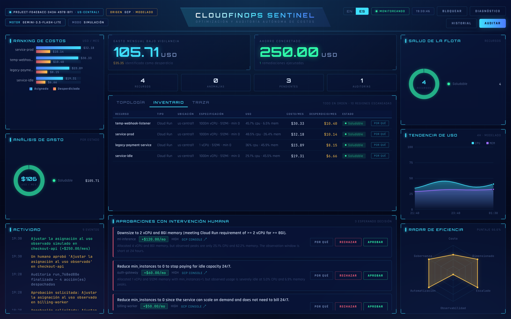

The interface ships in English and Spanish, switchable from the header. The
choice persists in `localStorage`; on first visit it follows the browser's
`Accept-Language`, falling back to English.

Translation spans three layers, because UI text comes from three places:

| Layer | Where it lives | How it is translated |
|---|---|---|
| Static chrome | `static/js/i18n.js` | `data-i18n` attributes, swapped in place |
| Generated analysis | `core/i18n.py` | `/api/state?lang=` returns evidence, rules, solutions and autonomy already localised |
| Persisted text | Memory bank | Events and approval tickets store a **key plus structured params**, rendered at read time |

That third layer matters: an approval ticket raised during a nightly audit is
read later, possibly by someone using the other language. Storing the finished
sentence would freeze it in whichever language the agent happened to run in, so
tickets persist `action_key` and `change_specs`
(`{kind: "memory", from: "2Gi", to: "512Mi"}`) instead of prose.

Figures never change across languages — a test asserts every number in the
evidence table is identical in both. `gcloud` commands are never translated.
Resource `status` stays a stable English token for CSS and filtering; only the
human-facing `verdict` is localised.

## Tests

```bash
pytest
```

356 tests — 354 pass and 2 skip where the OpenTelemetry exporter is
unavailable — covering the memory bank, cost math, the autonomy matrix, the DRY_RUN
safety gate, tool serialization, LLM analysis and failure handling, model
fallbacks, action dispatch per resource type, the real-data guarantees, the
rationale engine, translation completeness, the execution trace, scan history,
lazy startup, preflight, the approval-to-execution contract, simulated /
real isolation, the Firestore backend, the Gemma tier, outbound
notifications and the API —
all against simulated infrastructure with
writes disabled, no credentials required.

## Project layout

```
app/
  main.py                 FastAPI routes; blocking GCP calls run off the event loop
  core/
    config.py             Environment-driven settings
    i18n.py               Translation catalogue for generated text
    trace.py              Execution trace + live SSE fan-out
    analyst.py            One structured LLM call: judgement over the whole fleet
    planner.py            Turns the analysis into an ordered plan
    executor.py           Carries the plan out, enforcing the autonomy matrix
    agent.py              Gemini client, tool loop, heuristic fallback
    prompts.py            System instruction + audit prompt template
    telemetry.py          OpenTelemetry setup → Cloud Trace
    auth.py               Token auth, constant-time comparison
  models/schemas.py       Pydantic contracts
  tools/
    gcp_metrics.py        Cloud Run inventory, cost math, chart aggregations
    gcp_inventory.py      Multi-region, multi-service real resource discovery
    gcp_monitoring.py     Real CPU/memory utilization from Cloud Monitoring
    gcp_actions.py        Real mutations, gated by the DRY_RUN safety flag
    gcp_remediator.py     Agent-facing tools + autonomy matrix enforcement
    rationale.py          Evidence, rules, sizing and the autonomy explanation
    preflight.py          Readiness diagnostics ("what do I still need?")
    memory_tools.py       Persistent memory bank (approvals, history, events)
    notifications.py      Approval tickets pushed to Slack / Telegram
    state_store.py        Firestore / file / in-memory persistence backends
  web/
    index.html            Command deck
    static/css|js         Hand-built HUD; no framework, no CDN JS
    static/js/i18n.js     UI string catalogue (en/es)
deploy/                   One-command Cloud Run deploy + Cloud Scheduler
docs/                     Architecture notes, diagrams and screenshots
tests/                    356 tests, no credentials needed
```

## Known limitations

- Cost is estimated from *allocated* CPU/memory at Cloud Run Tier-1 on-demand
  rates, assuming an always-on instance. It is not read from the Cloud Billing
  export, so treat it as a right-sizing signal rather than an invoice.
- Disk deletion and Artifact Registry purging are implemented but need their own
  APIs enabled and their discovery paths wired to your registry layout.
- When Cloud Monitoring is unreachable the dashboard falls back to a
  deterministic utilization model and labels itself `MODELLED` — never
  presenting simulated numbers as real ones. Confidence drops to `low`
  accordingly.

## License

MIT — see [LICENSE](LICENSE).
