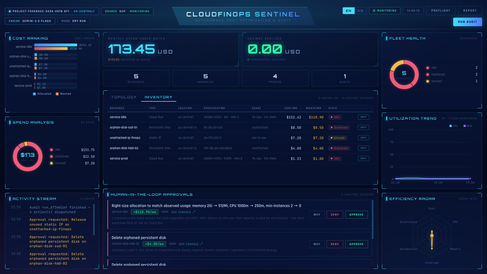

# CloudFinOps Sentinel

Autonomous cloud cost optimization and auditing for Google Cloud Platform,
powered by Gemini with a human-in-the-loop approval gate.

The agent inspects Cloud Run services, estimates what each one costs against
what it actually uses, and either fixes the cheap problems itself or opens an
approval ticket for the risky ones. A real-time command deck shows the fleet,
the money, and every decision the agent made.



## How it works

```
Cloud Scheduler ──► /webhook/pubsub ─┐
                                      ├─► CloudFinOpsAgent ──► Gemini + tools
Dashboard "Run Audit" ──► /api/trigger┘         │
                                                ├─ Level 1: execute directly
                                                └─ Level 2: approval ticket ──► human
                                                                                  │
                                     Memory Bank ◄────────────────────────────────┘
```

### The autonomy matrix

| Level | Example | Behaviour |
|-------|---------|-----------|
| 1 — Safe | Purge untagged images, resize a service saving < $40/mo | Executed directly |
| 2 — High risk | Delete a disk, resize a service saving ≥ $40/mo | Approval ticket, nothing runs until a human clicks Approve |

The matrix is enforced **in code**, not only in the prompt — see
`app/tools/gcp_remediator.py`. If the model tries to execute a Level 2 action,
the tool downgrades it to a ticket.

### The Memory Bank

Every remediation is recorded with its `resource_id`. Tools call
`check_history()` before acting, so a resource is never remediated twice — even
across process restarts, because state is persisted to `STATE_FILE`.

## Going live on a real GCP project

Drop your service-account JSON in the project root — `PROJECT_ID` and
credentials are picked up automatically, no env var needed. Then check what
actually works:

```bash
python -m app.tools.preflight
```

It verifies credentials, every API the agent depends on, and write access, and
prints the exact `gcloud` command that fixes each failure (with your service
account's email already filled in). The same report is at `/api/preflight` and
behind the **PREFLIGHT** button in the dashboard.

### Required APIs and roles

| Capability | API to enable | Role |
|---|---|---|
| Read Cloud Run services | `run.googleapis.com` | `roles/run.viewer` |
| **Resize** Cloud Run services | `run.googleapis.com` | `roles/run.admin` |
| Real CPU/memory utilization | `monitoring.googleapis.com` | `roles/monitoring.viewer` |
| Gemini via Vertex AI *(optional)* | `aiplatform.googleapis.com` | `roles/aiplatform.user` |
| Delete orphaned disks *(optional)* | `compute.googleapis.com` | `roles/compute.storageAdmin` |
| Purge untagged images *(optional)* | `artifactregistry.googleapis.com` | `roles/artifactregistry.admin` |

```bash
PROJECT=your-project
SA=your-sa@your-project.iam.gserviceaccount.com

gcloud services enable run.googleapis.com monitoring.googleapis.com --project=$PROJECT

gcloud projects add-iam-policy-binding $PROJECT --member=serviceAccount:$SA --role=roles/run.viewer
gcloud projects add-iam-policy-binding $PROJECT --member=serviceAccount:$SA --role=roles/monitoring.viewer
```

### The DRY_RUN safety gate

`DRY_RUN=true` is the default. In that mode the agent does everything — detects
anomalies, reasons, decides, opens approval tickets — but reports the change it
*would* make instead of applying it. Remediations are recorded with
`applied: false` and the dashboard header shows `MODE: DRY RUN`.

To let the agent actually modify infrastructure:

```bash
DRY_RUN=false uvicorn app.main:app --port 8080
```

The header switches to a red **LIVE WRITES** badge. In this mode
`resize_cloud_run` performs a real read-modify-write on the service template
(preserving image, env vars, scaling and concurrency) and deploys a new
revision. Grant `roles/run.admin` first.

## Quick start

```bash
python3 -m venv .venv && source .venv/bin/activate
pip install -r requirements-dev.txt

cp .env.example .env      # add your GEMINI_API_KEY (optional)

uvicorn app.main:app --reload --port 8080
```

Open <http://localhost:8080>.

**No API key? No GCP project?** It still runs. With `MOCK_MODE=true` the agent
audits a simulated six-service fleet, and without `GEMINI_API_KEY` it falls back
to a deterministic heuristic audit that follows the same autonomy matrix. The
dashboard labels which mode you are in (`SOURCE: SIMULATED`, `ENGINE: HEURISTIC`)
so demo data is never mistaken for live data.

```bash
MOCK_MODE=true uvicorn app.main:app --port 8080
```

## Configuration

Everything is environment-driven — see `.env.example`. Nothing sensitive is
hardcoded, and credentials resolve through Application Default Credentials on
Cloud Run.

| Variable | Default | Purpose |
|----------|---------|---------|
| `PROJECT_ID` / `REGION` | *(from key file)* / `us-central1` | Which project to audit |
| `GEMINI_API_KEY` | *(empty)* | Enables the LLM agent; empty → heuristic mode |
| `USE_VERTEX` | `false` | Use Vertex AI with the service account instead of a key |
| `DRY_RUN` | `true` | **Safety gate** — false lets the agent mutate live infrastructure |
| `USE_REAL_METRICS` | `true` | Pull utilization from Cloud Monitoring |
| `GEMINI_MODEL` | `gemini-3.5-flash-lite` | Must support `generateContent`; falls back automatically |
| `HIGH_RISK_ROI_THRESHOLD` | `40.0` | Savings above which a human must approve |
| `MEMORY_ANOMALY_THRESHOLD_GIB` | `1.0` | Memory allocation that counts as oversized |
| `MAX_TOOL_CALLS` | `4` | Tool calls per audit; each one is an API request |
| `METRICS_CACHE_TTL` | `60` | Seconds a Cloud Run listing is cached |
| `STATE_FILE` | `data/memory_bank.json` | Local memory-bank path |
| `STATE_BACKEND` | `auto` | `firestore` on Cloud Run, `file` locally |
| `MOCK_MODE` | `false` | Skip GCP entirely and use simulated infrastructure |
| `SCAN_REGIONS` | `auto` | Regions to scan, or a comma-separated list |
| `ALLOW_SIMULATED_FALLBACK` | `false` | Substitute demo data when a GCP call fails |

## API

| Method | Path | Description |
|--------|------|-------------|
| `GET` | `/` | Command deck dashboard |
| `GET` | `/health` | Liveness probe + active agent mode |
| `GET` | `/api/state` | Full dashboard snapshot: KPIs, approvals, resources, charts, activity |
| `GET` | `/api/resources?refresh=true` | Fleet inventory, optionally bypassing the cache |
| `GET` | `/api/resources/{id}/rationale` | Why a resource was flagged, and the concrete fix |
| `GET` | `/api/events?limit=50` | Activity log |
| `GET` | `/api/trace?since=N` | Execution steps with request/response payloads |
| `GET` | `/api/trace/stream` | Live SSE feed of execution steps |
| `POST` | `/api/trigger` | Start an audit in the background |
| `POST` | `/api/audit` | Run an audit and wait for the result |
| `POST` | `/api/approvals` | `{resource_id, status}` — approve or reject a ticket |
| `POST` | `/webhook/pubsub` | Cloud Scheduler / Pub/Sub push entrypoint |
| `GET` | `/api/preflight` | Readiness report: credentials, APIs, roles, write access |
| `POST` | `/api/reset` | Clear the memory bank (demo reset) |

Interactive docs at `/docs`.

## What "real" means here

The product never presents invented infrastructure as real:

- **An empty project is a real answer.** A successful API call that returns
  zero services reports `data_source: gcp` with an empty fleet — it is not
  replaced with demo data.
- **Simulated data requires explicit opt-in.** Only `MOCK_MODE=true`, or an
  API failure with `ALLOW_SIMULATED_FALLBACK=true`, produces the demo fleet —
  and the header says `SOURCE: SIMULATED` when it does.
- **Unreadable sources are shown, not hidden.** A disabled API or missing role
  appears as an amber badge under the topology instead of silently reading as
  "nothing found".
- **Utilization is labelled.** `MONITORING` when it came from Cloud Monitoring,
  `MODELLED` when the metric was unavailable.

### Multi-region and multi-service discovery

Scanning one region misses services deployed elsewhere. `SCAN_REGIONS=auto`
probes the ten common Cloud Run regions in parallel; set it to a comma-separated
list to narrow the scan.

Discovery covers Cloud Run services, orphaned persistent disks, unused static
IPs, and untagged Artifact Registry images — all shown in one inventory. Each source degrades independently:
a disabled Compute API does not stop the Cloud Run audit.

### Cost model

`min_instances > 0` bills around the clock regardless of traffic, so an
always-on service with no load is the most expensive kind of idle — and is
flagged as such. A scale-to-zero service is costed against its observed
utilization instead of its ceiling.

## The agent loop

```
Trigger → Observe → Analyse → Plan → Execute → Adapt → Remember
          (code)   (Gemini)  (Gemini)  (code)  (Gemini)  (Firestore)
```

Not a chat loop and not a fixed script. Each audit:

1. **Observes** — four GCP APIs across ten regions in parallel, plus Cloud
   Monitoring for real utilization peaks.
2. **Analyses** — one structured Gemini call over the whole fleet returns a
   verdict, diagnosis, target shape, risk and confidence per resource.
3. **Plans** — a second Gemini call turns that analysis into an *ordered plan*:
   which tool, on which resource, with which arguments, and what each step
   expects to achieve.
4. **Executes** — the agent carries the plan out, with the autonomy matrix
   enforced in code: Level 1 runs unattended, Level 2 becomes an approval
   ticket, anything under the value threshold is skipped and said so.
5. **Adapts** — when a step fails, the plan is sent back to the model to be
   revised around the failure (up to twice) rather than abandoning the run.
6. **Remembers** — remediations, tickets, runs and the *shape* each resource had
   when it was acted on, so the next audit knows what is genuinely new.

Cost is bounded deliberately: two Gemini calls per audit, plus one per failed
round. A tool-calling loop would spend one request per invocation and exhaust a
free-tier minute on a single audit.

See [docs/ARCHITECTURE.md](docs/ARCHITECTURE.md) for the full diagram.

## Who decides what

The split matters, so it is explicit:

| | Produced by | Why |
|---|---|---|
| Allocation, utilization, cost | Deterministic code + GCP APIs | Measurement is fact. A model must never invent a number. |
| Diagnosis, recommendation, risk | **The LLM** | Judgement is what a model is for. |
| The plan: which tool, in what order | **The LLM** | Sequencing actions under a goal. |
| Adapting after a failed step | **The LLM** | Deciding whether to retry differently or stop. |
| Level 1 vs Level 2 vs no action | Deterministic code | A persuasive model must not be able to talk its way into executing a Level 2 action. |
| Execution | Deterministic code | One handler per resource type, never inferred. |

Each audit makes **one structured call** covering the whole fleet. The model
receives only measured facts — never a pre-computed conclusion to echo — and
returns a verdict, diagnosis, recommendation, target shape, risk and confidence
per resource, plus a fleet summary. Per-resource calls would exhaust a
free-tier minute on a single audit.

The resource drawer shows the model's analysis first, with the measurements it
was given underneath, so a recommendation can always be traced to the numbers
behind it. Every approval ticket carries the model's own wording.

If the model is unreachable the audit still completes on deterministic rules
and says so — it never presents a computed guess as an analysis.

## Resource states

| State | Colour | Meaning |
|---|---|---|
| `Healthy` | green | Allocation matches observed usage |
| `Tolerated` | green | Technically idle or oversized, but the recoverable waste is under `MIN_SAVINGS_THRESHOLD` |
| `Oversized` | amber | Actionable over-allocation |
| `Idle` | red | Actionable idle capacity |
| `Orphaned` / `Unused` | red / amber | Unattached disk or reserved IP |

`Tolerated` exists because a resource with $1/month of recoverable waste is
correctly sized for practical purposes. Painting it red implies an action that
will never be taken, and a fleet that always looks broken teaches operators to
ignore the colour. Such resources stay on the topology and in the KPIs — they
exist and they are fine — with the drawer explaining why no change is proposed.

## Follow-up actions

A remediation that leaves waste behind must remain actionable. The memory bank
records the **shape** a resource had when it was acted on — CPU, memory,
min-instances — and a later scan compares against it:

- unchanged since the last action → duplicate, skipped;
- changed and still wasteful → eligible again;
- previously rejected by a human → skipped regardless of shape.

Without the shape comparison a partially fixed resource is blocked forever, and
the dashboard shows an anomaly with no ticket to act on. Approval tickets carry
the complete target shape (`{"memory": "512Mi", "cpu": "250m",
"min_instances": 0}`), so an approved change applies in full — booking a saving
for a change that only partly happened is worse than not acting at all.

## Live updates

The dashboard polls every 5 seconds, but waiting for the next tick makes a
click feel unacknowledged. Every mutation — an approval, a rejection, a
completed execution, a finished audit — pushes a `{"kind": "state"}` message
down the same SSE stream that carries the trace, and every open dashboard
refetches immediately.

Measured approval-to-render latency: **~12 ms**, against a 5000 ms poll
interval. The poll remains as a fallback for when the stream is unavailable,
and the approval card dims optimistically so the click registers even before
the round-trip completes.

## Seeing the estate, and the reasoning

**Inventory** — the centre panel toggles between the topology graph and a full
table of every managed resource: type, location, specification, observed usage,
monthly cost, waste and state. Types are described in their own terms, so a
disk is not forced into Cloud Run's columns.

**Why** — clicking any row, node, or approval opens a drawer with the complete
chain of reasoning:

| Section | Answers |
|---|---|
| Evidence | Every measured value, each labelled with its source (Cloud Run API, Cloud Monitoring, cost model) |
| Why it was flagged | The rule id, the condition checked, the values observed, and why it costs money |
| Proposed change | Current shape → proposed shape, and the expected monthly and yearly saving |
| Confidence | `high`/`medium`/`low`, based on how much real metric history exists |
| Autonomy decision | Level 1 / Level 2 / reported-only, and the reason for that level |
| Equivalent command | The exact `gcloud` command to apply the same change by hand |

Recommendations are deliberately conservative: sizing is capped at a **4x
reduction per audit** with a 256Mi floor. A service with only minutes of traffic
history shows artificially low peaks, and a 16x cut on that evidence is a guess.
Repeated audits converge safely instead. When a cap applies, the drawer says so.

Rules cover Cloud Run (`IDLE_ALWAYS_ON`, `IDLE_SERVICE`, `OVERSIZED_ALLOCATION`),
persistent disks (`ORPHANED_DISK`), static IPs (`UNUSED_STATIC_IP`) and Artifact
Registry (`UNTAGGED_IMAGE`). Disk deletion and IP release are always Level 2
regardless of savings, because both are irreversible.

## Nothing runs until you ask

Starting the service touches no GCP API. The dashboard opens in an idle state
(`SOURCE: NOT SCANNED`) and polling never triggers a scan — `/api/state` reads
cache only. Discovery, analysis and remediation all begin when the operator
presses **RUN AUDIT** (or a scheduler calls `/webhook/pubsub`).

That keeps a restart free, avoids surprise API quota usage, and makes the trace
below correspond to one deliberate run instead of ambient background activity.

## Execution trace

The **Trace** tab streams every step live over server-sent events, grouped by
phase, with the real payloads attached:

```
DISCOVERY  run.googleapis.com · ListServices across 10 region(s)      42ms
DISCOVERY  Cloud Run · 2 service(s) found                             ▸ response
DISCOVERY  compute.googleapis.com · disks.aggregatedList              ▸ response
ANALYSIS   Evaluating 5 resource(s) against detection rules
ANALYSIS   service-idle → Idle ($118.90/mo recoverable)               ▸ evidence
DECISION   Autonomy Level 2 → escalating service-idle for approval    ▸ reason
APPROVAL   Operator approved '…' on service-idle                      ▸ ticket
EXECUTION  GET service service-idle                                   ▸ current limits
EXECUTION  PATCH service service-idle → 512Mi                         ▸ request + response
EXECUTION  Action complete on service-idle
```

Click any step to expand its detail. For a mutation that is the point: the
`request` shows exactly what was sent to GCP, and the `response` carries GCP's
own confirmation — the new revision name, the limits it actually applied, and
the `Ready` condition:

```json
{
  "gcp_confirmed": true,
  "ready_state": "CONDITION_SUCCEEDED",
  "new_revision": "service-idle-00042-xyz",
  "applied_limits": {"cpu": "250m", "memory": "512Mi"},
  "uri": "https://service-idle-....run.app"
}
```

While `DRY_RUN=true` the execution step is recorded as
`DRY_RUN · not sent to GCP` and carries a `would_send` payload instead, so the
exact request can be reviewed before enabling writes.

Endpoints: `GET /api/trace?since=<seq>` for a snapshot, `GET /api/trace/stream`
for the live SSE feed.

> Trace messages, API method names and payload keys stay in English regardless
> of the UI language — it is a technical console, and translating
> `projects.locations.services.patch` would make it harder to match against GCP
> documentation.

## Languages

The interface ships in English and Spanish, switchable from the header. The
choice persists in `localStorage`; on first visit it follows the browser's
`Accept-Language`, falling back to English.

Translation spans three layers, because UI text comes from three places:

| Layer | Where it lives | How it is translated |
|---|---|---|
| Static chrome | `static/js/i18n.js` | `data-i18n` attributes, swapped in place |
| Generated analysis | `core/i18n.py` | `/api/state?lang=` returns evidence, rules, solutions and autonomy already localised |
| Persisted text | Memory bank | Events and approval tickets store a **key plus structured params**, rendered at read time |

That third layer matters: an approval ticket raised during a nightly audit is
read later, possibly by someone using the other language. Storing the finished
sentence would freeze it in whichever language the agent happened to run in, so
tickets persist `action_key` and `change_specs` (`{kind: "memory", from: "2Gi",
to: "512Mi"}`) instead of prose.

Figures never change across languages — a test asserts every number in the
evidence table and the expected result is identical in both. `gcloud` commands
are never translated. Resource `status` stays a stable English token for CSS and
filtering; only the human-facing `verdict` is localised.

Adding a language means adding one dictionary to each catalogue; tests fail if
the key sets or the `{placeholders}` drift apart.

## Resilience

The LLM is the optional part of this system. The audit itself — anomaly
detection, cost math, the autonomy matrix, the memory bank — is deterministic
and always runs. When Gemini is unavailable the agent finishes the audit
heuristically and says so, rather than losing the cycle:

| Failure | Behaviour |
|---|---|
| No API key configured | Heuristic audit, `ENGINE: HEURISTIC` in the header |
| 429 quota exhausted | Heuristic fallback + retry-delay hint |
| 503 on every candidate model | Heuristic fallback, findings unaffected |
| Model not found (404) | Falls through `MODEL_FALLBACKS` automatically |
| Model at capacity (503) | Tries the next model — capacity is per-model |
| Cloud Run API unavailable | Simulated fleet, labelled `SOURCE: SIMULATED` |
| Cloud Monitoring unavailable | Modelled utilization, labelled `MODELLED`, 5-min backoff |

Degraded runs are marked in the audit report with an amber banner explaining
what was skipped. `audit_infrastructure()` always returns the same keys, on
success and on failure alike.

### Model availability

Google retires models for *new* API keys while keeping them alive for existing
ones, so a model can appear in `models.list()` and still return **404
NOT_FOUND** when you call it — `gemini-2.5-flash` behaves exactly this way for
recently created keys.

A 404 here means "this model is not available to your key", not "your key is
invalid". Preflight distinguishes the two and, on a 404, lists the models your
key can actually call instead of sending you to regenerate a working credential.

If the configured model is unavailable, the agent walks `MODEL_FALLBACKS`
automatically rather than failing the run.

### Choosing a model

Two properties matter, and they are easy to confuse:

| Model family | Supported action | Usable here |
|---|---|---|
| `gemini-*-flash`, `gemini-*-flash-lite` | `generateContent` | ✅ |
| `gemini-*-live-*`, `*-translate-*` | `bidiGenerateContent` | ❌ Live API over WebSocket |
| `*-image`, `*-tts`, `veo-*`, `lyria-*` | media generation | ❌ |

A Live model is not a lighter version of Flash — it is a different protocol for
streaming audio and video. Configuring one produces a failure that looks like a
broken credential, so preflight checks `supported_actions` first and names the
real reason.

`flash-lite` is the default: it has the highest free-tier request limit and
returns the fleet analysis in about two seconds, where the heavier Flash models
frequently time out on a fleet-sized prompt.

### Gemini free-tier quota

The free tier allows **5 requests per minute**, and every automatic function
call is a separate request. `MAX_TOOL_CALLS` defaults to `4` so a single audit
fits inside that budget. On a paid tier, raise it:

```bash
MAX_TOOL_CALLS=12
```

When the model spends its whole budget on tool calls and never writes a closing
report, the agent reconstructs one from the action ledger — what it actually
applied and escalated — instead of showing a placeholder.

## Tests

```bash
pytest
```

229 tests covering the memory bank, cost math, the autonomy matrix, the DRY_RUN
safety gate, tool serialization, LLM analysis and failure handling, model
fallbacks, action dispatch per resource type, the real-data guarantees, the
rationale engine, translation completeness, the execution trace, scan history,
lazy startup, preflight and the API — all against simulated infrastructure with
writes disabled, no credentials required.

## Persistence

The Memory Bank is what stops the agent looping, so where it lives matters.
`STATE_BACKEND=auto` picks the right one: **Firestore** when running on Cloud
Run (whose filesystem is ephemeral — a new revision would otherwise forget
everything it had already remediated), a **local JSON file** otherwise. Set it
to `firestore`, `file` or `none` to override.

If Firestore is unreachable the agent starts anyway and says so: an agent that
cannot read its history is still more useful than one that will not boot.

## Deploy to Cloud Run

```bash
./deploy/deploy.sh
```

One command: enables the APIs, creates a least-privilege service account,
provisions Firestore, stores the Gemini key in Secret Manager, builds and
deploys, and schedules hourly audits. See [deploy/README.md](deploy/README.md)
for what each role is for and how to verify the result.

The deploy script schedules hourly audits through Cloud Scheduler, which is
what makes the agent autonomous rather than button-driven: it runs while nobody
is watching and leaves approval tickets waiting.

## Project layout

```
app/
  main.py                 FastAPI routes; blocking GCP calls run off the event loop
  core/
    config.py             Environment-driven settings
    i18n.py               Translation catalogue for generated text
    trace.py              Execution trace + live SSE fan-out
    analyst.py            One structured LLM call: judgement over the whole fleet
    planner.py            Turns the analysis into an ordered, executable plan
    executor.py           Carries the plan out, enforcing the autonomy matrix
    agent.py              Gemini client, tool loop, heuristic fallback
    prompts.py            System instruction + audit prompt template
  models/schemas.py       Pydantic contracts
  tools/
    gcp_metrics.py        Cloud Run inventory, cost math, chart aggregations
    gcp_inventory.py      Multi-region, multi-service real resource discovery
    gcp_monitoring.py     Real CPU/memory utilization from Cloud Monitoring
    gcp_actions.py        Real mutations, gated by the DRY_RUN safety flag
    gcp_remediator.py     Agent-facing tools + autonomy matrix enforcement
    rationale.py          Evidence, rules, sizing and the autonomy explanation
    preflight.py          Readiness diagnostics ("what do I still need?")
    memory_tools.py       Persistent memory bank (approvals, history, events)
    state_store.py        Firestore / file / in-memory persistence backends
  web/
    index.html            Command deck
    static/css|js         Hand-built HUD; no framework, no CDN JS
    static/js/i18n.js     UI string catalogue (en/es)
tests/                    36 tests, no credentials needed
```

## Known limitations

- Cost is estimated from *allocated* CPU/memory at Cloud Run Tier-1 on-demand
  rates, assuming an always-on instance. It is not read from the Cloud Billing
  export, so treat it as a right-sizing signal rather than an invoice.
- Disk deletion and Artifact Registry purging are implemented but need their
  own APIs enabled and their discovery paths wired to your registry layout.
- The memory bank is a JSON file. Swap in Firestore
  (`google-cloud-firestore` is already a dependency) for multi-instance
  deployments.
- When Cloud Monitoring is unreachable the dashboard falls back to a
  deterministic utilization model and labels itself `MODELLED` — never
  presenting simulated numbers as real ones.
