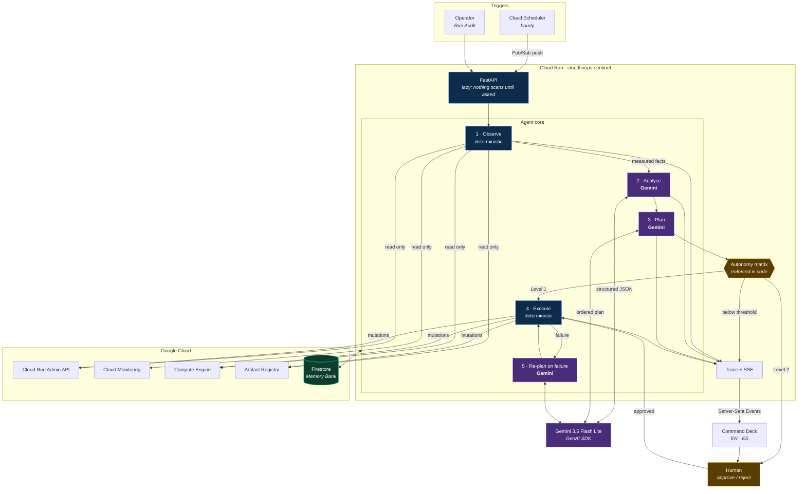
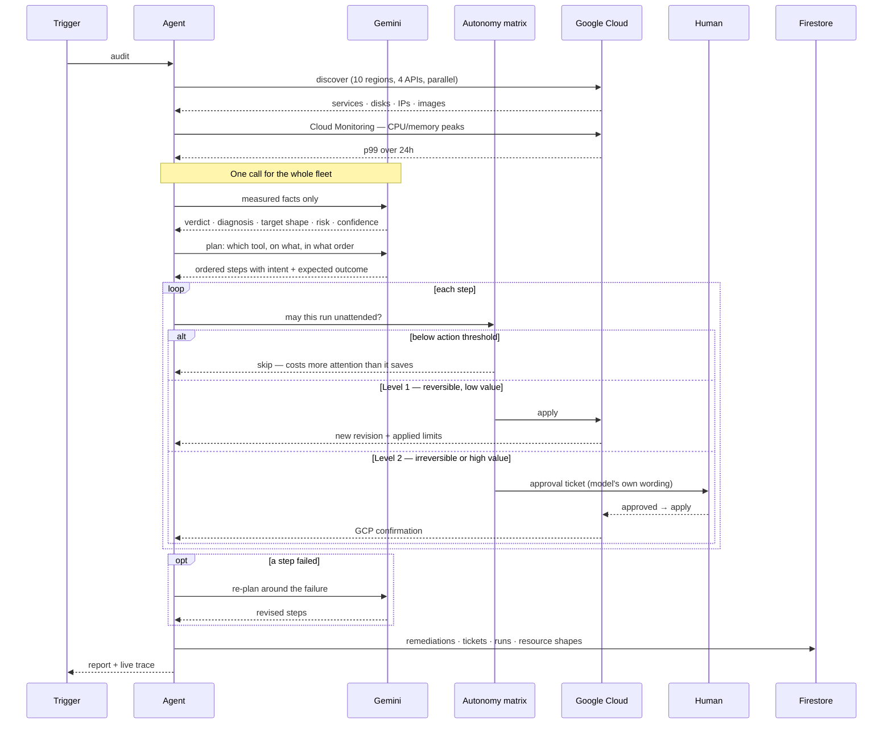

# Architecture

## System

## The agent loop

## Where the LLM sits

| Stage | Decided by | Why |
|---|---|---|
| Discovery, cost, utilization | Code + GCP APIs | Measurement is fact; a model must not invent a number |
| Diagnosis, recommendation, risk | **Gemini** | Judgement is what a model is for |
| Plan: which tool, what order | **Gemini** | Sequencing under a goal |
| Level 1 / Level 2 / skip | Code | A persuasive model must not talk its way into an irreversible action |
| Execution | Code | One handler per resource type, never inferred |
| Adaptation after failure | **Gemini** | Deciding whether to retry differently or stop |

## Failure behaviour

| Failure | Response |
|---|---|
| Model unavailable / quota / 503 | Deterministic audit completes; the report says so |
| Model unavailable to this key (404) | Walks `MODEL_FALLBACKS` |
| A plan step fails | Re-plans around it, up to twice |
| Model proposes an unknown tool | Step dropped before dispatch, and logged |
| Cloud Monitoring unavailable | Modelled utilization, labelled `MODELLED`, 5-min backoff |
| Compute API disabled | Cloud Run audit continues; the gap is shown, not hidden |
| Firestore unavailable | Runs without history rather than refusing to start |
